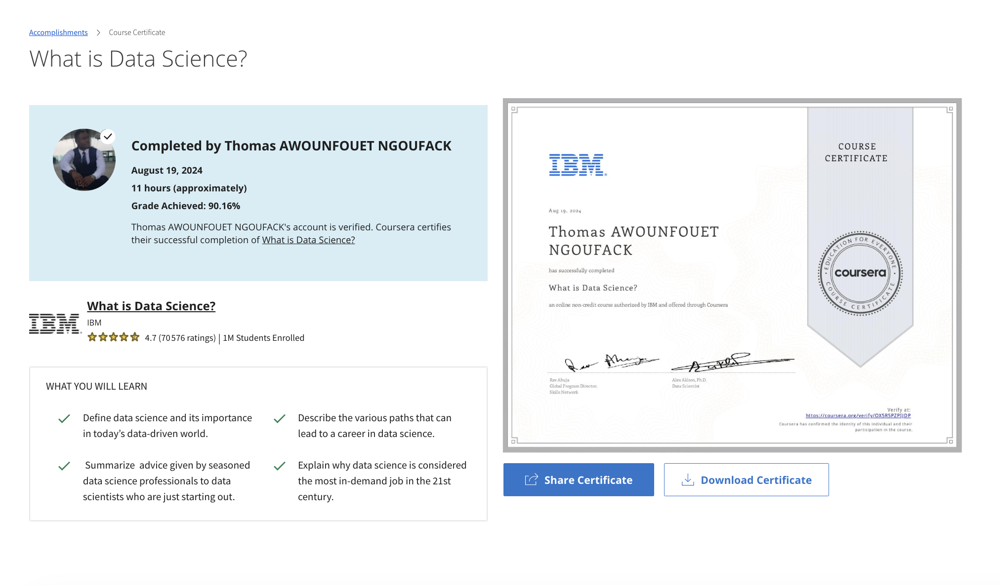

# What is Data Science ? 

## Objectifs
- Define data science and its importance in today’s data-driven world.
- Describe the various paths that can lead to a career in data science.
- Summarize  advice given by seasoned data science professionals to data scientists who are just starting out.
- Explain why data science is considered the most in-demand job in the 21st century. 

## Certificate of Completion 

https://www.coursera.org/account/accomplishments/verify/OX5R5PZPIJDP 

## Course Syllabus

This course provides an introduction to the field of data science, including its fundamental concepts, various career paths, and essential skills. It explores what data science is and what data scientists do and offers advice for those interested in pursuing a career in this exciting field.

### Defining Data Science and What Data Scientists Do

#### Defining Data Science
- Defining Data Science
- Video: What is Data Science?
- Fundamentals of Data Science
- The Many Paths to Data Science
- Data Science: The Sexiest Job in the 21st Century 
- Defining Data Science
- Advice for New Data Scientists

#### What Do Data Scientists Do?
- A Day in the Life of a Data Scientist
- Data Science Skills & Big Data
- Working on Different File Formats
- Data Science Topics and Algorithms
- Discussion Prompt: Introduce Yourself
- Reading: What Makes Someone a Data Scientist?

### Data Science Topics
#### Big Data and Data Mining
- How Big Data is Driving Digital Transformation
- Introduction to Cloud
- Cloud for Data Science
- Foundations of Big Data
- Data Scientists at New York University
- What is Hadoop?
- Big Data Processing Tools: Hadoop, HDFS, Hive, and Spark
- Reading: Data Mining

#### Deep Learning and Machine Learning
- Artificial Intelligence and Data Science
- Generative AI and Data Science
- Neural Networks and Deep Learning
- Applications of Machine Learning
- Reading: Regression
- Lab: Exploring Data using IBM Cloud Gallery

### Applications and Careers in Data Science:
#### Data Science Application Domains
- How Should Companies Get Started in Data Science?
- Old Problems with New Data Science Solutions
- Applications of Data Science
- How Data Science is Saving Lives
- Reading: The Final Deliverable

#### Careers and Recruiting in Data Science
- How Can Someone Become a Data Scientist?
- Recruiting for Data Science
- Careers in Data Science
- Importance of Mathematics and Statistics for Data Science (only name change)
- The Report Structure
- Reading: Infograph on roadmap 

### Data Literacy for Data Science (Optional):

#### Understanding Data
- Understanding Data
- Data Sources
- Working on Varied Data Sources and Types
- Reading: Metadata

#### Data Literacy
- Data Collection and Organization
- Relational Database Management System
- NoSQL
- Data Marts, Data Lakes, ETL, and Data Pipelines
- Considerations for Choice of Data Repository
- Data Integration Platforms

