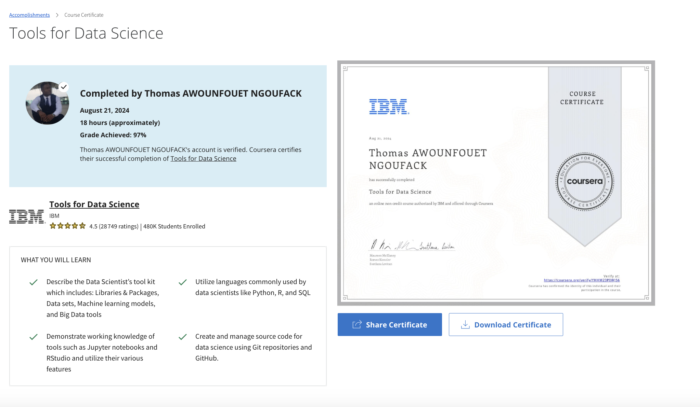

# Data Science Topi 

In the first lesson in this module, you gain insight into the impact of big data on various aspects of society, from business operations to sports, and develop an understanding of key attributes and challenges associated with big data. You will learn about the big data fundamentals, how data scientists use the cloud to handle big data, and the data mining process. Lesson two delves into machine learning and deep learning and the relationship of artificial intelligence to data science.

## Learning Objectives
- Define Big Data and its distinguishing characteristics, such as velocity, volume, veracity, and value
- Describe how Hadoop and other big data tools, combined with distributed computing power, are triggering digital transformation.
- List some of the skills required to be a data scientist and analyze big data.
- Describe the five essential cloud computing characteristics
- Explain what data mining is.
- Summarize the importance of establishing goals, data selection, preprocessing, transformation, and storage of data in preparation for data mining.
- Explain the difference between deep learning and machine learning.
- Describe regression and how it might be used to predict market behavior and trend analysis.
- Describe generative AI

## Certificate of Completion

