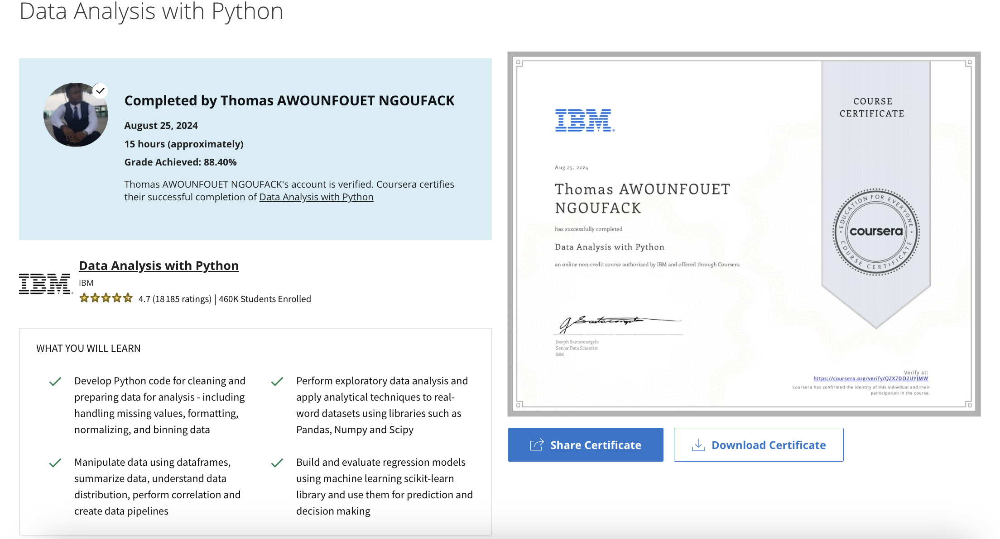

# Data Analysis with Python

Learn how to prepare data for analysis, with Python.

## What you will learn

- Develop Python code for cleaning and preparing data for analysis - including handling missing values, formatting, normalizing, and binning data
- Perform exploratory data analysis and apply analytical techniques to real-word datasets using libraries such as Pandas, Numpy and Scipy
- Manipulate data using dataframes, summarize data, understand data distribution, perform correlation and create data pipelines
- Build and evaluate regression models using machine learning scikit-learn library and use them for prediction and decision making
 

## Course Certificate

Verify link : https://www.coursera.org/account/accomplishments/verify/QZX7DO2UYJMW 