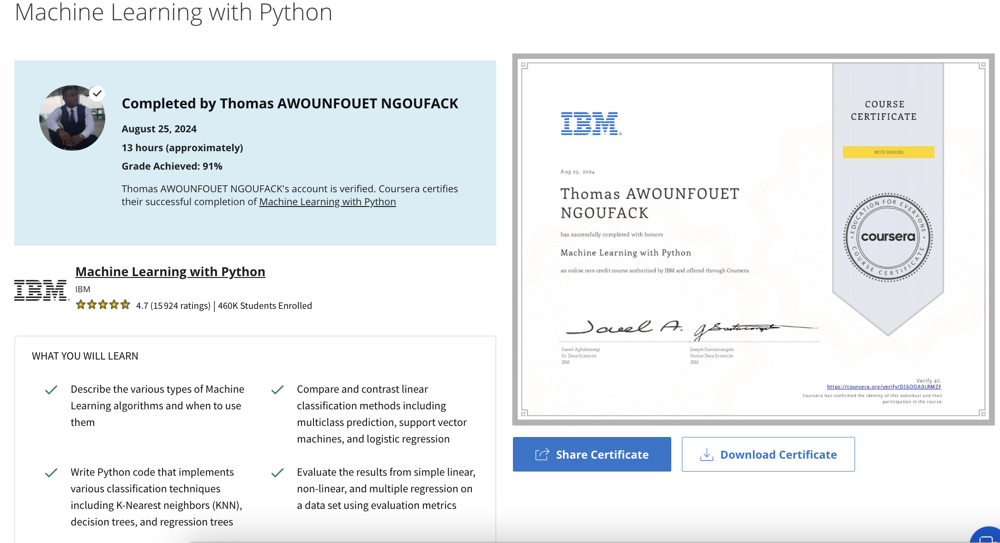

# Machine Learning with Python

## What you will learn
- Describe the various types of Machine Learning algorithms and when to use them  

- Compare and contrast linear classification methods including multiclass prediction, support vector machines, and logistic regression  

- Write Python code that implements various classification techniques including K-Nearest neighbors (KNN), decision trees, and regression trees 

https://www.coursera.org/account/accomplishments/verify/DI6ODA0LRMZF 