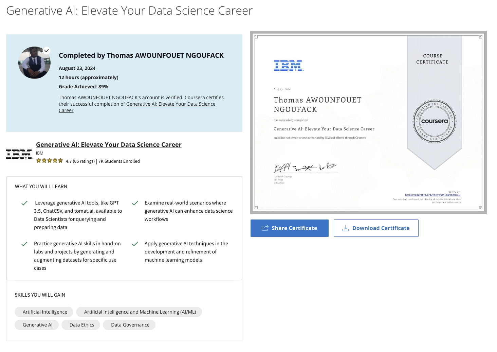

# Generative AI - Elevate your Data Science Career

## Abstract
The landscape of data science is undergoing a dramatic transformation, fueled by the rise of a powerful new tool: generative AI. This cutting-edge technology transcends the traditional role of data analysis, venturing beyond the realm of extracting insights from existing data and into the realm of creation. Generative AI empowers data scientists to generate entirely new data, unlocking a universe of possibilities and tackling previously insurmountable challenges.

This course explores generative AI tools and their applications in data science and aims to empower data professionals with cutting-edge skills and knowledge. In this course, you will delve into generative AI, exploring its applications, hands-on use, and ethical considerations in the data science landscape. As the course progresses, you will learn to integrate generative AI into data science projects, including data augmentation and feature engineering. The course concludes with the skills data scientists require to succeed in their field and how generative AI can help them hone these skills in today’s world. 

## Course learning objectives 

After completing this course, you will be able to:

- Explain the fundamental concepts of generative artificial intelligence and its significance in data science.
- Apply generative AI techniques to real-world data science problems, including data augmentation, data generation, and feature engineering.
- Analyze real-world case studies where generative AI has been successfully implemented and identify the key factors contributing to their success.
- Discuss the advantages, challenges, and ethical considerations of using generative AI in data augmentation and feature engineering and make informed decisions.
- Gain practical experience by implementing generative AI models and techniques in hands-on labs and projects.
- Apply the concepts learned throughout the course to a data science project, including data augmentation and feature engineering.
- Communicate effectively and articulate ideas related to generative AI and data science through discussion prompts and forums.

## Course Syllabus

Module 1: Data Science and Generative AI 
- Welcome
- Data Science and Generative AI  
- Generative AI for Data Preparation and Querying
- Module Summary and Quiz

Module 2: Use of Generative AI for Data Science
- Generative AI for Understanding Data and Model Building
- Generative AI Considerations for Data Professionals 
- Module Summary and Quiz

Module 3: Guided Project and Exam  
- Final Project
- Final Exam
- Course Wrap-Up

